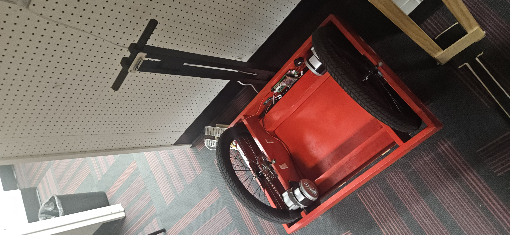
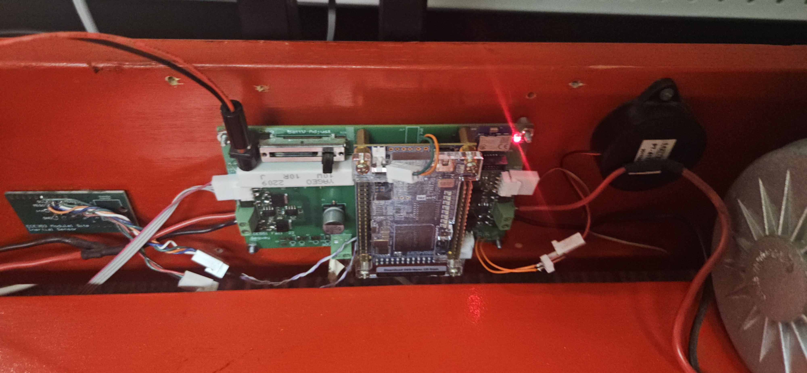
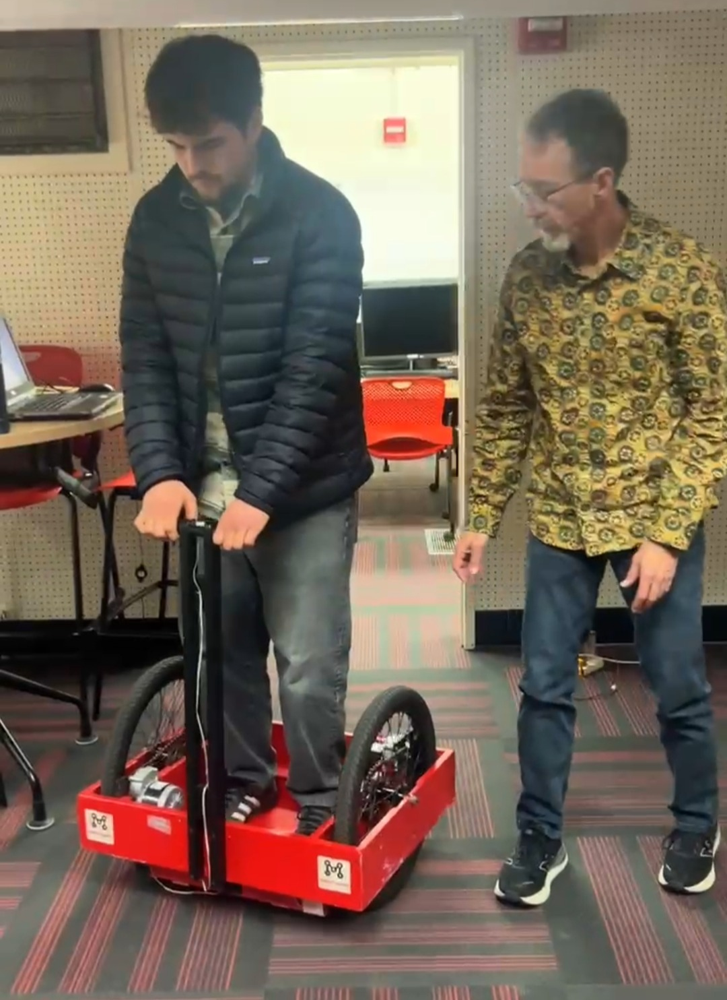

# Segway Control

This repository contains SystemVerilog driver modules I authored during Digital Design and Synthesis (ECE551) at the University of Wisconsin–Madison.

The course was project-based, with the objective of programming an FPGA to serve as the control board for a self-balancing Segway-style robot.

## Project Overview

Throughout the semester, I wrote hardware description modules including motor control, sensor interfacing, and timing logic for the Segway using System Verilog. These modules were later integrated into a full control system.

The folder drivers/ contains the driver files used in the final project and the folder semester-modules/ contains the files I wrote throughout the entire semester.

## My Contribution

At the end of the semester, we formed groups to integrate the modules from throughout the semester for the final project. The group I had was very ambitious and completed the majority of the steps for integration well before the project deadline. During this time, I was unfortunately off-campus on Thanksgiving break which limited my involvement in the project.

When I got back to Madison, there wasn't much for me to do outside of proofreading the entire project and verifying its compliance with the rubric. So, I created this repository to showcase the code I personally authored.

I've linked the completed project at the bottom of this readme.

## Here is the entire project 

[View the complete group project repository](https://github.com/petezhaa/segway_control_project)

### Thank you for viewing the repository!
